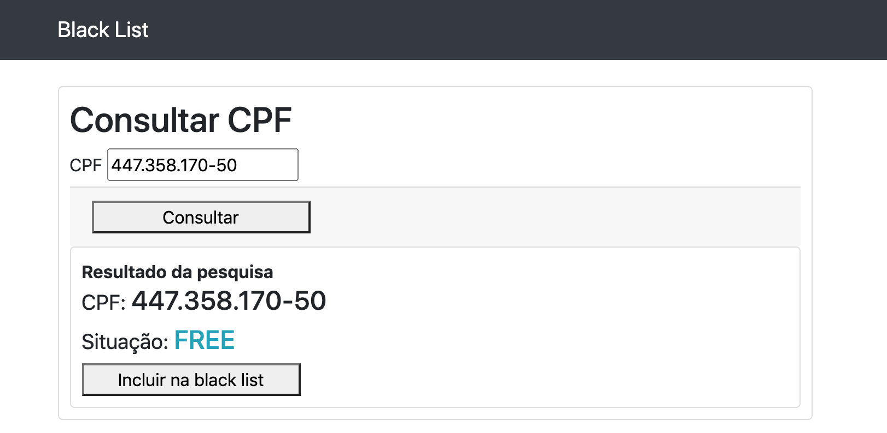

# CPF blacklist - Rails+Vue

Application for "Black List" control for CPFs (brazilian personal ID).
It was developed with Ruby on Rails and the frontend in Vue.js. For masking I used v-mask.
This project is in a Docker container (including PostgreSQL), there are unit tests in RSpec and custom validators.

## Web
The front was developed in Vue.js
It is just a single screen with a search field where the user can inform the CPF and get the blocked (BLOCK) or free (FREE) information.
After searching, the user can block or unblock the CPF, according to its original status.

### API
The following endpoints are available:

- `GET /consulta?cpf=<CPF>`
This returns the status of the searched CPF

- `POST /blocks Params: block[cpf]`
This creates a new block from the CPF sent

- `GET /status`
This returns the last server_update (date the server was started), queries (number of queries performed since the server was started) and the count of blocks (number of blocks in the database)

- `DELETE /blocks/<ID DE BLOQUEIO>`
This removes the block from a cpf. Note that he receives the ID of the block, not the CPF.

- `GET /blocks`
This returns the list of all blocks. It may be refactored to support pagination.

- `GET /blocks/<ID DE BLOQUEIO>`
Returns the details of a lock. Note that he receives the ID of the block, not the CPF.

### Dependencies

This project uses the following dependencies:
- yarn add vue-turbolinks
- yarn add vue-resource
- npm install v-mask
- gem 'cpf_cnpj'
- gem 'rspec-rails'

### Instructions

1. docker-compose run --service-ports rails bash
2. yarn install
3. rails server --binding 0.0.0.0